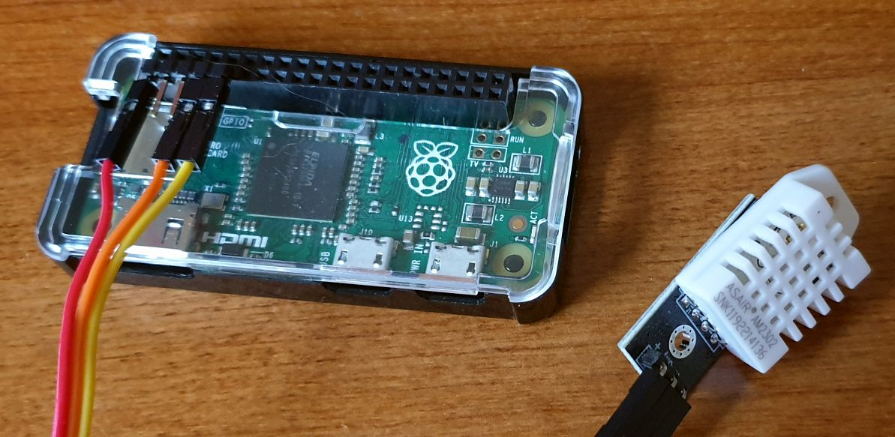
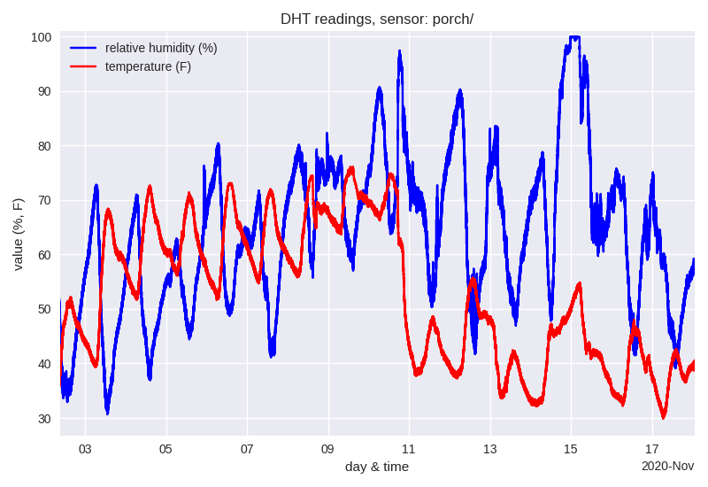

dhtioc
======

Provide humidity and temperature using EPICS and Raspberry Pi.

   Assembled *dhtioc* system.

Typical measurements from *dhtioc* plotted:

    Readings from *dhtioc* system mounted on porch. Values recorded
    every few seconds, logged into files. Note the unseasonably warm
    temperatures until Nov. 10 when the temperature dropped, accompanied
    by a mild rain. Definitely rainy on Nov. 14-15 (note the 100%
    humidity).

    Plotting software not part of this package.  Yet.

See the :ref:`Table of Contents <contents>` for links to all the
documentation.

.. toctree::
   :hidden:

   contents
